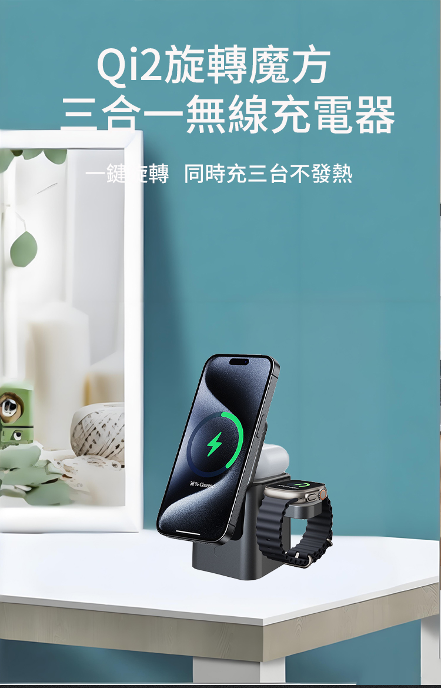

# 無線充電架單品落地頁 - 部署和自定義指南

## 📋 項目概述

您現在擁有一個**完整的、專業的無線充電架單品落地頁**，包含：

✅ **產品展示**
- 14 張高清產品圖片輪播
- 縮圖導航快速切換
- 響應式設計

✅ **購物功能**
- 4 種顏色選擇（黑色、白色、銀色、金色）
- 4 種套餐方案（單件、買一送一、三件組、四件組）
- 數量選擇器
- 加入購物車 / 立即購買

✅ **社會證明**
- 實時購買記錄（每 30 秒更新）
- 客戶評價區
- 信任標籤

✅ **詳細信息**
- 規格參數表
- 產品詳細描述
- 常見問題解答

✅ **視覺設計**
- 深灰藍 + 明亮藍配色（科技感）
- 紅色優惠標籤
- 綠色信任標籤
- 完全響應式設計

---

## 🚀 快速部署（3 步）

### 步驟 1：上傳文件到 GitHub

1. 打開 https://github.com/123pogoo/gopoo
2. 點擊 **Code** → **Upload files**
3. 上傳以下文件：
   - `index.html`
   - `styles.css`
   - `script.js`
   - `vercel.json`
   - `images/` 文件夾（所有產品圖片）
4. 點擊 **Commit changes**

### 步驟 2：在 Vercel 中部署

1. 打開 https://vercel.com
2. 點擊 **Add New** → **Project**
3. 選擇 `123pogoo/gopoo` 仓库
4. 點擊 **Deploy**
5. 等待完成，獲得臨時網址：`https://gopoo.vercel.app`

### 步驟 3：配置 gopoo.shop 域名

1. 在 Vercel 中：Settings → Domains → Add Domain → 輸入 `gopoo.shop`
2. 複製 Vercel 的 4 個 Nameserver 地址
3. 在 Namesilo 中：Manage Domain → Edit Nameservers → 粘貼地址
4. 等待 DNS 生效（1 小時內）
5. 訪問 `https://gopoo.shop` ✅

---

## 🎨 自定義指南

### 修改產品信息

編輯 `index.html`，找到以下部分並修改：

```html
<!-- 產品標題 -->
<h1 class="product-title">無線充電架</h1>

<!-- 價格 -->
<span class="original-price">NT$1,299</span>
<span class="current-price">NT$899</span>

<!-- 顏色選擇 -->
<button class="color-btn active" data-color="黑色" style="background-color: #000;"></button>
<button class="color-btn" data-color="白色" style="background-color: #fff; border: 1px solid #ccc;"></button>

<!-- 套餐方案 -->
<button class="package-btn active" data-package="單件" data-price="899">
    <span class="package-name">單件</span>
    <span class="package-price">NT$899</span>
</button>
```

### 修改產品圖片

1. 確保所有圖片都在 `images/` 文件夾中
2. 圖片命名應為：`无线充电架_01.jpg` 到 `无线充电架_14.jpg`
3. 在 `index.html` 中修改圖片路徑：

```html


```

### 修改顏色配色

編輯 `styles.css`，修改 CSS 變數：

```css
:root {
    --primary-color: #2c3e50;      /* 深灰藍 - 主色 */
    --secondary-color: #3498db;    /* 明亮藍 - 強調色 */
    --accent-color: #e74c3c;       /* 紅色 - 優惠標籤 */
    --success-color: #27ae60;      /* 綠色 - 信任標籤 */
    --light-bg: #f8f9fa;           /* 淺灰 - 背景 */
}
```

### 修改店鋪信息

編輯 `index.html` 的頁腳部分：

```html
<div class="footer-section">
    <h4>聯絡我們</h4>
    <p>📧 Email: service@gopoo.shop</p>
    <p>📱 WhatsApp: +886-900-000-000</p>
    <p>💬 Line: @gopoo</p>
</div>
```

### 修改產品描述

編輯 `index.html` 中的產品特點和詳細描述：

```html
<div class="product-description">
    <h3>產品特點</h3>
    <ul>
        <li>✓ 智能感應，自動對齊充電</li>
        <li>✓ 相容所有 Qi 標準設備</li>
        <!-- 添加更多特點 -->
    </ul>
</div>
```

---

## 📁 文件結構

```
gopoo-wireless-charger/
├── index.html                  # 主頁面（可編輯）
├── styles.css                  # 樣式文件（可編輯）
├── script.js                   # JavaScript 功能（可編輯）
├── vercel.json                 # Vercel 配置（無需修改）
├── images/                     # 產品圖片文件夾
│   ├── 无线充电架_01.jpg
│   ├── 无线充电架_02.jpg
│   ├── ...
│   └── 无线充电架_14.jpg
└── DEPLOYMENT_GUIDE.md         # 本文件
```

---

## 🔧 高級自定義

### 修改套餐方案

在 `index.html` 中修改套餐按鈕：

```html
<div class="package-options">
    <button class="package-btn active" data-package="單件" data-price="899">
        <span class="package-name">單件</span>
        <span class="package-price">NT$899</span>
    </button>
    <button class="package-btn" data-package="買一送一" data-price="1299">
        <span class="package-name">買一送一</span>
        <span class="package-price">NT$1,299</span>
        <span class="package-badge">省NT$499</span>
    </button>
</div>
```

### 修改規格參數

在 `index.html` 中修改規格表：

```html
<table class="specs-table">
    <tr>
        <td>產品名稱</td>
        <td>無線充電架</td>
    </tr>
    <tr>
        <td>充電功率</td>
        <td>15W 快速充電</td>
    </tr>
    <!-- 添加更多規格 -->
</table>
```

### 修改客戶評價

在 `index.html` 中修改評價區：

```html
<div class="review-item">
    <div class="review-header">
        <span class="review-name">林小姐</span>
        <span class="review-rating">★★★★★</span>
    </div>
    <p class="review-text">非常好用！充電速度快，設計也很精美。</p>
    <span class="review-date">2024年3月5日</span>
</div>
```

---

## 📊 功能說明

### 購物車功能

- 用戶選擇顏色、套餐、數量後點擊"加入購物車"
- 商品會保存到瀏覽器的 localStorage
- 購物車數量會顯示在右下角浮窗
- 刷新頁面後購物車數據不會丟失

### 購買記錄

- 每 30 秒自動更新一次
- 顯示隨機生成的購買記錄
- 營造熱銷和緊迫感

### 響應式設計

- 自動適配手機、平板、桌面
- 在不同屏幕尺寸上都有最佳體驗
- 觸摸設備友好

---

## 🚀 部署後的優化

### 1. 集成真實支付

修改 `script.js` 中的 `buyNow()` 函數，集成支付網關：

```javascript
function buyNow() {
    // 集成支付 API
    // 例如：綠界、Stripe 等
}
```

### 2. 添加分析追蹤

在 `index.html` 的 `<head>` 中添加 Google Analytics：

```html
<script async src="https://www.googletagmanager.com/gtag/js?id=GA_ID"></script>
<script>
  window.dataLayer = window.dataLayer || [];
  function gtag(){dataLayer.push(arguments);}
  gtag('js', new Date());
  gtag('config', 'GA_ID');
</script>
```

### 3. 添加 Facebook 像素

在 `index.html` 的 `<head>` 中添加：

```html
<script>
  !function(f,b,e,v,n,t,s)
  {if(f.fbq)return;n=f.fbq=function(){n.callMethod?
  n.callMethod.apply(n,arguments):n.queue.push(arguments)};
  // 添加您的 Pixel ID
}(window, document,'script');
fbq('init', 'YOUR_PIXEL_ID');
fbq('track', 'PageView');
</script>
```

### 4. 優化 SEO

修改 `index.html` 的 `<head>` 部分：

```html
<meta name="description" content="高品質無線充電架，15W 快速充電，支持所有 Qi 標準設備。免運費、貨到付款。">
<meta name="keywords" content="無線充電架, 充電器, Qi 充電">
<meta property="og:title" content="無線充電架 - GOPOO 官方商城">
<meta property="og:description" content="高品質無線充電架，15W 快速充電">
<meta property="og:image" content="https://gopoo.shop/images/无线充电架_01.jpg">
```

---

## 📞 常見問題

### Q: 如何修改產品圖片？

A: 
1. 將新圖片上傳到 `images/` 文件夾
2. 在 `index.html` 中修改圖片路徑
3. 提交更改，Vercel 會自動重新部署

### Q: 如何添加新的套餐？

A:
1. 在 `index.html` 中複製一個套餐按鈕
2. 修改 `data-package` 和 `data-price` 屬性
3. 修改顯示文本
4. 提交更改

### Q: 如何修改顏色？

A:
1. 編輯 `styles.css` 中的 CSS 變數
2. 或修改 `index.html` 中的 `style` 屬性
3. 提交更改，刷新頁面查看效果

### Q: 購物車數據會丟失嗎？

A: 不會。購物車數據保存在瀏覽器的 localStorage 中，刷新頁面後仍會保留。

### Q: 如何集成真實支付？

A: 
1. 選擇支付網關（綠界、Stripe 等）
2. 獲取 API 密鑰
3. 修改 `script.js` 中的 `buyNow()` 函數
4. 集成支付 API

---

## 🎯 下一步建議

1. **測試功能** - 在不同設備上測試購物流程
2. **優化圖片** - 壓縮圖片大小以提高加載速度
3. **集成支付** - 添加真實支付功能
4. **添加分析** - 安裝 Google Analytics 和 Facebook 像素
5. **SEO 優化** - 優化頁面標題、描述等
6. **Facebook 投放** - 開始投放廣告

---

## 📱 響應式設計斷點

- **桌面**：1200px 以上
- **平板**：768px - 1199px
- **手機**：480px - 767px
- **小屏幕**：480px 以下

---

## 🔐 安全建議

1. 定期備份代碼
2. 使用 HTTPS（Vercel 自動提供）
3. 不要在代碼中硬編碼敏感信息
4. 定期更新依賴包

---

## 📈 性能優化

- 圖片已優化，支持快速加載
- CSS 已最小化
- JavaScript 已優化
- 支持圖片延遲加載

---

祝您的無線充電架單品落地頁成功！🎉

如有任何問題，請參考本指南或聯繫技術支持。
